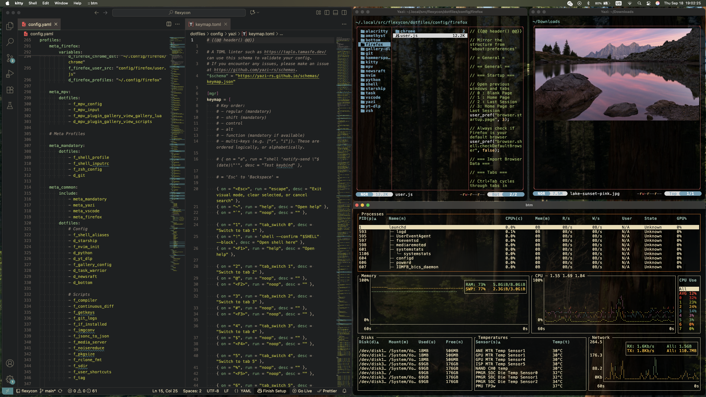
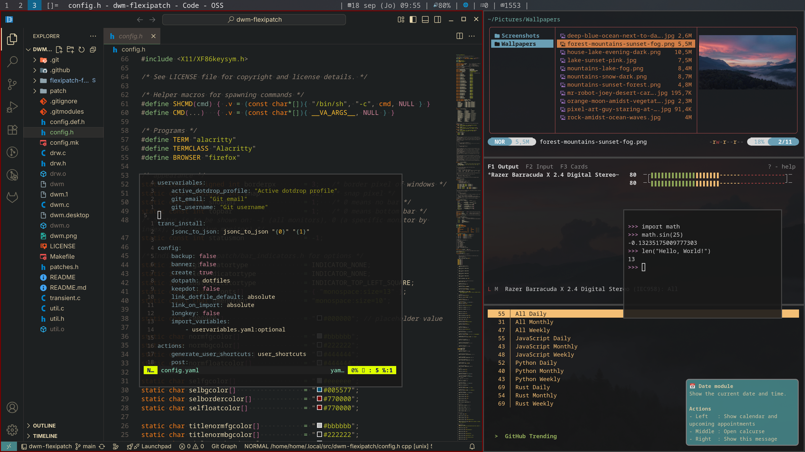
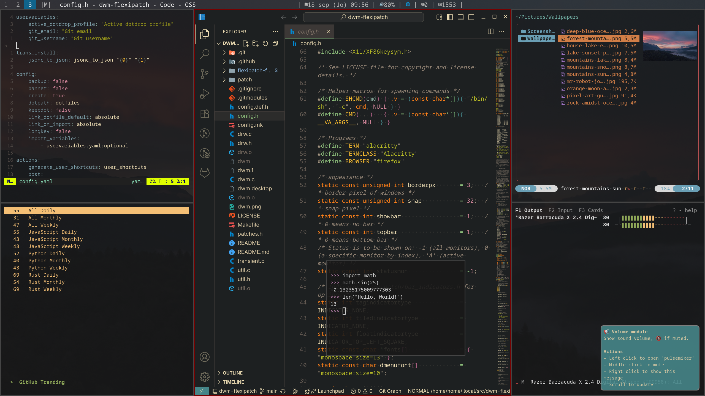

<div align="center">
    
    <h1>Flexycon</h1>
    🧩 Where configuration meets automation 💡
</div>

Flexycon (from _flexible_ + _configuration_) is my personal configuration ecosystem — a unified system
for managing configs, scripts, snippets, and shared utilities.
Instead of isolated dotfiles or one-off scripts, every component is designed to work together and build
off of one another.

By combining templating and a dotfile manager, I ensure that only the configuration I actually need is
deployed — customized automatically for each environment.

Examples:

```sh
# Per-platform config

export TERMINAL='kitty'

export TERMINAL='alacritty'


# Per-profile config

alias je='journal_entry'


# Environmental variables substitutions
editor = '{{@@ env["EDITOR"] @@}}'

# Easy file importing — break large configs into smaller pieces

```

- [Setup](#setup)
    - [Dependencies](#dependencies)
    - [Installation](#installation)
- [Gallery](#gallery)
    - [Mac](#mac)
    - [Linux](#linux)

# Setup

## Dependencies

Make sure you have the following installed:

- `git`
- `python >= 3.13`
- `make`

## Installation

To install and initialize the project:

```sh
git clone "https://github.com/Zen-Path/flexycon"
cd flexycon
make setup
make install
dotdrop install
```

When testing changes to the venv, or just needing a clean slate, you can use `make clean` and it will clean up the project a bit.

# Gallery

## Mac



## Linux

The Linux config is found in the `linux-android-profiles` branch.

Tile Layout:



Centered Master Layout:


