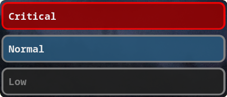

# Extra

Here you can find more details about my dotfiles.

- [Extra](#extra)
- [Setup](#setup)
    - [Linux](#linux)
        - [Dunst](#dunst)
- [Tips](#tips)
    - [Mac](#mac)
    - [Monday as first day of the week](#monday-as-first-day-of-the-week)
    - [Check available locales](#check-available-locales)
    - [Check current locale settings](#check-current-locale-settings)
    - [Extract only matches using rg](#extract-only-matches-using-rg)
    - [Kill a process that uses a port](#kill-a-process-that-uses-a-port)

# Setup

## Linux

### Dunst



Result of running:

```sh
notify-send "Low" -u low
notify-send "Normal" -u normal
notify-send "Critical" -u critical
```

# Tips

### Mac

- To make Finder always show hidden files:

```sh
defaults write com.apple.finder AppleShowAllFiles -bool true
killall Finder
```

- To hide items from the Desktop:

```sh
defaults write com.apple.finder CreateDesktop false
killall Finder
```

- To enable sleep:

```sh
sudo pmset -a disablesleep 0
```

Source: https://gist.github.com/laurion/d93eb70efcc6f3b3716173c94e74f435

### Monday as first day of the week

1. Open `/etc/locale.conf` and change `LC_TIME` to `en_DK.UTF-8` (Denmark)
2. Open `/etc/locale.gen` and uncomment `en_DK.UTF-8`
3. Regenerate locales by running:

```sh
sudo locale-gen
```

4. Reboot
5. Run `cal`. It should display 'Mon' as first day of the week.

### Check available locales

Run:

```sh
locale -a
```

### Check current locale settings

Run:

```sh
locale
```

### Extract only matches using rg

Run:

```sh
rg --only-matching 'pattern: (\d+)' --replace '$1'
```

### Kill a process that uses a port

To kill process that uses port `5002`:

```sh
fuser -k 5002/tcp
```

MacOS:

```sh
kill -9 $(/usr/sbin/lsof -t -i:5002)
```
