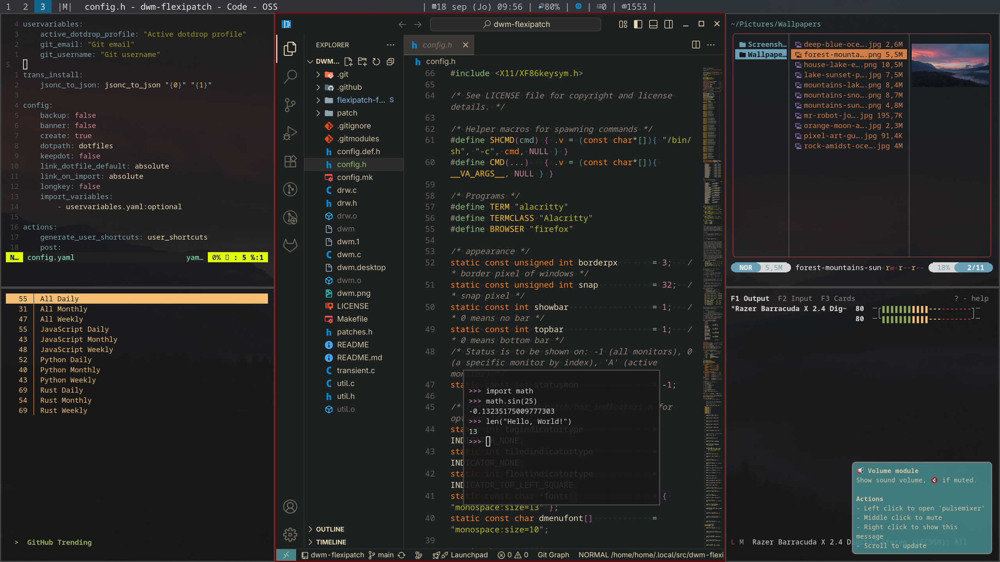
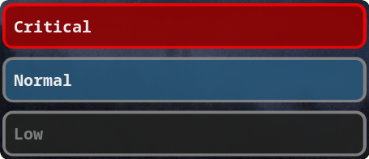

# Flexycon

Here you can find more details about my dotfiles.

# Linux




## Dunst



Result of running:

```sh
notify-send "Low" -u low
notify-send "Normal" -u normal
notify-send "Critical" -u critical
```
